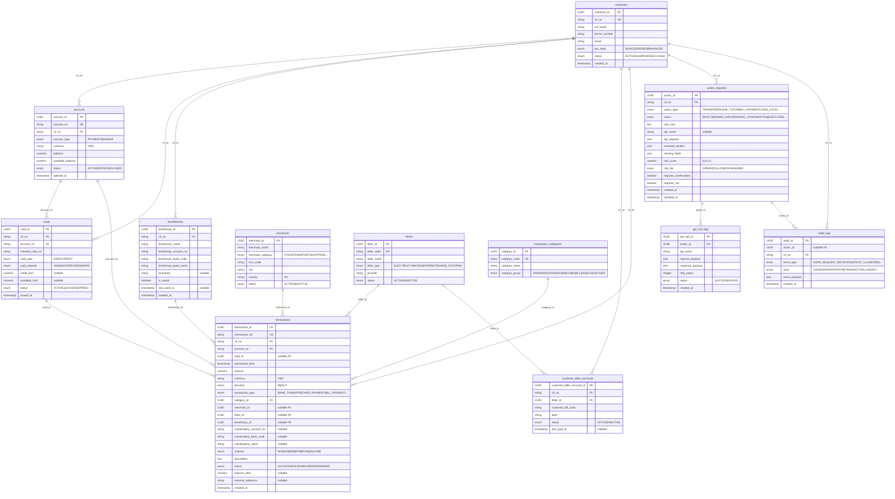

# Mock Banking Data

## Purpose

Mock data for AI banking assistant demo. Used for Text2SQL queries, transaction history,
beneficiary resolution, bill payment, phone top-up, and risk-checked action workflows.
Data is deterministic (seed=42) and reproducible.

## Tables

| # | Table | Rows |
|---|-------|------|
| 1 | customers | 100 |
| 2 | accounts | 193 |
| 3 | cards | 93 |
| 4 | beneficiaries | 354 |
| 5 | merchants | 81 |
| 6 | billers | 20 |
| 7 | customer_biller_accounts | 215 |
| 8 | transaction_categories | 20 |
| 9 | transactions | 5031 |
| 10 | action_requests | 120 |
| 11 | api_call_logs | 66 |
| 12 | audit_logs | 828 |

## ER Diagram



## Relationships (Text ER)

```
customers (cif_no) ─┬─< accounts (cif_no, account_no)
                    ├─< cards (cif_no, account_no → accounts)
                    ├─< beneficiaries (cif_no)
                    ├─< customer_biller_accounts (cif_no, biller_id → billers)
                    ├─< transactions (cif_no, account_no, card_id?, merchant_id?, biller_id?, beneficiary_id?, category_id)
                    ├─< action_requests (cif_no)
                    └─< audit_logs (cif_no, action_id → action_requests)

action_requests (action_id) ─< api_call_logs (action_id)
action_requests (action_id) ─< audit_logs (action_id)

merchants (merchant_id) ─< transactions
billers (biller_id) ─< transactions, customer_biller_accounts
transaction_categories (category_id) ─< transactions
```

## Use Case → Table Mapping

| Use Case | Tables |
|----------|--------|
| Chuyen tien cho Minh | beneficiaries, transactions, action_requests |
| Spending analysis | transactions, transaction_categories, merchants |
| Card transactions | transactions, cards, merchants |
| Bill payment | billers, customer_biller_accounts, transactions, action_requests |
| Phone top-up | transactions, action_requests |
| Anomaly detection | transactions (amount, time, beneficiary_id=null) |
| Fee inquiry | transactions (type=FEE) |
| Salary check | transactions (type=SALARY) |

## Sample Text2SQL Queries

### 1. Thang nay toi tieu bao nhieu cho an uong?
```sql
SELECT SUM(t.amount) as total
FROM transactions t
JOIN transaction_categories tc ON t.category_id = tc.category_id
WHERE t.cif_no = :cif_no
  AND tc.category_code = 'FOOD'
  AND t.transaction_time >= '2026-05-01'
  AND t.direction = 'OUT';
```

### 2. 3 giao dich gan nhat cua toi la gi?
```sql
SELECT * FROM transactions
WHERE cif_no = :cif_no
ORDER BY transaction_time DESC
LIMIT 3;
```

### 3. 3 giao dich the gan nhat cua toi?
```sql
SELECT * FROM transactions
WHERE cif_no = :cif_no AND transaction_type = 'CARD_PAYMENT'
ORDER BY transaction_time DESC
LIMIT 3;
```

### 4. Toi da chuyen cho Minh bao nhieu tien thang truoc?
```sql
SELECT SUM(t.amount) as total
FROM transactions t
JOIN beneficiaries b ON t.beneficiary_id = b.beneficiary_id
WHERE t.cif_no = :cif_no
  AND b.beneficiary_name LIKE '%Minh%'
  AND t.transaction_time >= '2026-04-01'
  AND t.transaction_time < '2026-05-01'
  AND t.direction = 'OUT';
```

### 5. Tai khoan nao cua toi co so du cao nhat?
```sql
SELECT account_no, account_type, balance
FROM accounts
WHERE cif_no = :cif_no AND status = 'ACTIVE'
ORDER BY balance DESC
LIMIT 1;
```

### 6. Toi da thanh toan hoa don dien thang nay chua?
```sql
SELECT * FROM transactions t
JOIN billers b ON t.biller_id = b.biller_id
WHERE t.cif_no = :cif_no
  AND b.biller_type = 'ELECTRICITY'
  AND t.transaction_time >= '2026-05-01';
```

### 7. Toi nap dien thoai cho so nao gan nhat?
```sql
SELECT counterparty_name, amount, transaction_time
FROM transactions
WHERE cif_no = :cif_no AND transaction_type = 'PHONE_TOPUP'
ORDER BY transaction_time DESC
LIMIT 1;
```

### 8. Co giao dich nao tren 10 trieu trong 7 ngay qua khong?
```sql
SELECT * FROM transactions
WHERE cif_no = :cif_no
  AND amount > 10000000
  AND transaction_time >= '2026-05-25';
```

### 9. Toi chi bao nhieu cho Grab trong thang nay?
```sql
SELECT SUM(t.amount) as total
FROM transactions t
JOIN merchants m ON t.merchant_id = m.merchant_id
WHERE t.cif_no = :cif_no
  AND m.merchant_name LIKE '%Grab%'
  AND t.transaction_time >= '2026-05-01'
  AND t.direction = 'OUT';
```

### 10. Luong thang nay da vao chua?
```sql
SELECT * FROM transactions
WHERE cif_no = :cif_no
  AND transaction_type = 'SALARY'
  AND transaction_time >= '2026-05-01'
  AND direction = 'IN';
```

## API Payload Examples

### TRANSFER
```json
{
  "from_account_no": "1234567890",
  "to_account_no": "9876543210",
  "to_bank_code": "VCB",
  "to_name": "Nguyen Van Minh",
  "amount": 2000000,
  "currency": "VND",
  "description": "Chuyen tien cho Minh"
}
```

### PHONE_TOPUP
```json
{
  "from_account_no": "1234567890",
  "phone_number": "0987654321",
  "telco": "VIETTEL",
  "amount": 100000,
  "currency": "VND"
}
```

### BILL_PAYMENT
```json
{
  "from_account_no": "1234567890",
  "biller_code": "EVN_HANOI",
  "customer_bill_code": "PD123456789",
  "amount": 1250000,
  "currency": "VND"
}
```

### CARD_LOCK
```json
{
  "card_id": "uuid-here",
  "masked_card_no": "**** **** **** 1234",
  "action": "LOCK",
  "reason": "USER_REQUEST"
}
```

### CARD_LIMIT_CHANGE
```json
{
  "card_id": "uuid-here",
  "masked_card_no": "**** **** **** 5678",
  "new_limit": 100000000,
  "currency": "VND"
}
```
